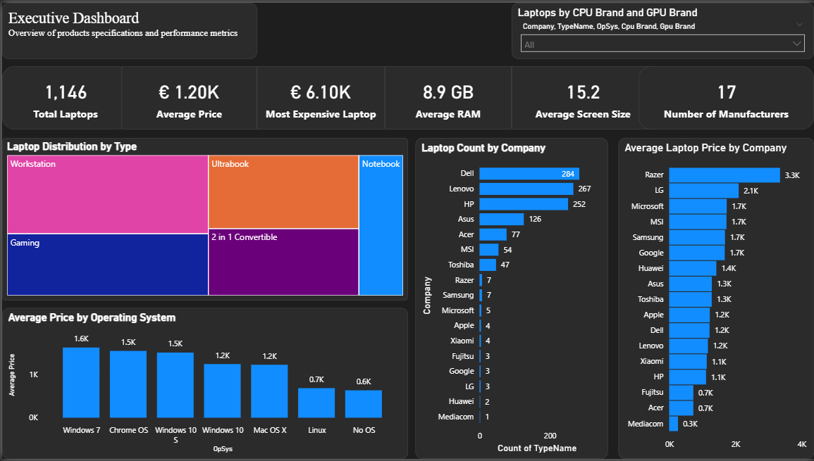
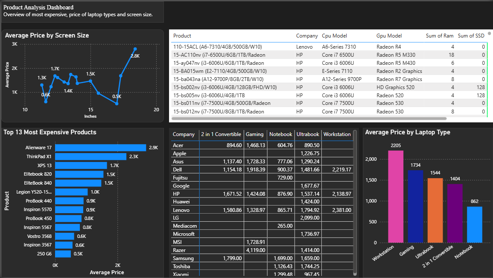
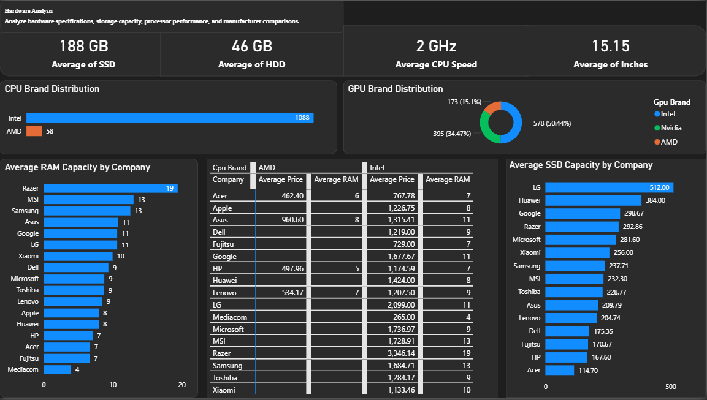
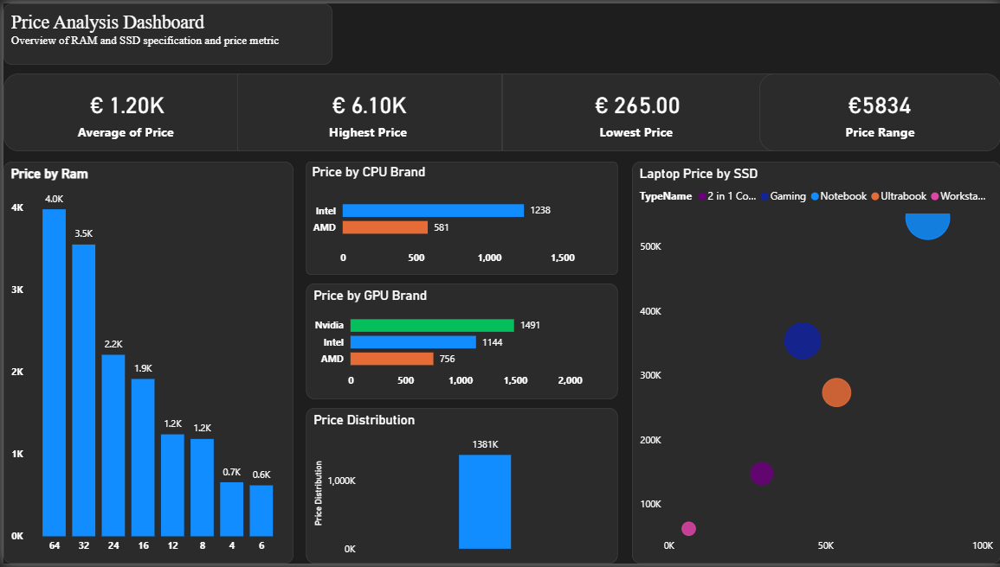

# 💻 Laptop Market Analysis Dashboard | Power BI

## 📌 Overview

The **Laptop Market Analysis Dashboard** is an interactive Business Intelligence solution developed in **Power BI** to analyze laptop pricing, hardware specifications, manufacturer performance, and product categories. The report provides decision-makers with valuable insights into pricing trends, hardware configurations, and market distribution through interactive dashboards.

The project consists of four report pages:

- 📊 Executive Dashboard
- 🖥️ Product Analysis Dashboard
- ⚙️ Hardware Analysis Dashboard
- 💰 Price Analysis Dashboard

---

## 🎯 Business Problem

Laptop prices vary significantly depending on specifications such as RAM, storage capacity, processor, graphics card, operating system, and manufacturer. Businesses and consumers require an analytical solution that enables easy comparison between products and identifies the key drivers of laptop pricing.

This dashboard centralizes laptop market data into an interactive report, allowing users to explore pricing patterns, compare manufacturers, and analyze hardware performance.

---

## 🎯 Project Objectives

- Analyze laptop pricing across manufacturers.
- Compare hardware specifications between brands.
- Identify premium laptop categories.
- Evaluate CPU and GPU market distribution.
- Analyze the relationship between hardware specifications and price.
- Build an executive dashboard for business decision-making.

---

# 📄 Dashboard Pages

## 1️⃣ Executive Dashboard

Provides an executive summary of the laptop market using high-level KPIs and performance visuals.

## 📊 Overview

This page provides a high-level summary of the laptop market, enabling stakeholders to quickly assess key performance indicators, pricing trends, and manufacturer performance. It serves as the starting point of the report by presenting essential metrics and visualizations that support strategic decision-making.

The dashboard highlights the overall market landscape through KPIs such as the total number of laptops, average selling price, highest-priced laptop, average RAM, average screen size, and the number of manufacturers. Interactive charts further analyze laptop distribution by type, manufacturer market share, average price by company, and operating system trends.

This dashboard allows executives to monitor market composition, identify leading manufacturers, compare pricing across brands, and gain an overall understanding of the laptop industry before exploring more detailed analyses in the subsequent report pages.

### Business Value

Allows executives to quickly understand market size, pricing trends, and manufacturer performance.

## Key Insights 
- The dataset contains 1,146 laptops from 17 manufacturers, providing a broad view of the laptop market.
- The average laptop price is €1.20K, while the most expensive laptop costs €6.10K, indicating a wide range of products from budget to premium devices.
- The average laptop is equipped with 8.9 GB of RAM and has an average screen size of 15.2 inches, suggesting that mid-range configurations dominate the market.
- Dell, Lenovo, and HP have the largest number of laptop models, highlighting their strong market presence.
- Razer records the highest average laptop price, reflecting its focus on premium and high-performance devices.
- Workstations and Gaming laptops represent the highest-value product segments, while Notebooks are more affordable on average.
- Windows-based operating systems dominate the dataset and generally command higher average prices than Linux or laptops without an operating system.
- Executive Summary

The laptop market is dominated by major manufacturers such as Dell, Lenovo, and HP, while premium brands like Razer lead in average pricing. Most laptops feature mid-range hardware specifications, with Workstations and Gaming devices driving the premium end of the market. These insights help stakeholders understand market composition, pricing strategies, and manufacturer positioning at a glance.

---

## 2️⃣ Product Analysis Dashboard

Focuses on product specifications and pricing comparisons.

## 🖥️ Overview 

This page provides a detailed view of laptop products by examining their categories, manufacturers, screen sizes, and pricing. It enables users to compare product offerings across different brands and identify high-value laptop segments within the market.

The dashboard includes interactive visualizations that highlight the most expensive laptop models, average prices by laptop type and screen size, product distribution across manufacturers, and detailed product specifications. These insights help stakeholders understand market positioning, product diversity, and pricing differences among laptop categories.

By exploring product-level data, users can identify premium product lines, compare manufacturers, and evaluate how product characteristics contribute to overall market trends.

### Business Value

Helps identify premium laptop models, compare laptop categories, and evaluate pricing across different screen sizes.

## 📈 Key Insights

- **Workstation laptops** have the highest average selling price, followed closely by **Gaming laptops**, indicating that high-performance devices command premium prices.
- **Razer** and **LG** produce some of the most expensive laptop models in the dataset, reflecting their focus on premium market segments.
- Laptops with **larger screen sizes** generally have higher average prices than smaller models.
- The **Top 13 most expensive laptops** are primarily concentrated within premium product categories, demonstrating a strong relationship between product type and pricing.
- **Dell, Lenovo, and HP** offer the widest variety of laptop models, providing customers with options across multiple price ranges and categories.
- Product pricing varies significantly across manufacturers, highlighting different market positioning and pricing strategies.

---

## 3️⃣ Hardware Analysis Dashboard

Analyzes hardware specifications and manufacturer performance.

## ⚙️ Overview

This page provides an in-depth analysis of the technical specifications of laptops across different manufacturers. It focuses on key hardware components such as processors, graphics cards, memory, storage, and display characteristics to help users compare performance and understand hardware trends within the laptop market.

The dashboard features KPIs summarizing average hardware specifications alongside interactive visualizations that compare CPU and GPU brands, RAM capacity, SSD storage, and manufacturer performance. These insights enable stakeholders to evaluate hardware configurations, identify market preferences, and assess how manufacturers differentiate their products through component selection.

This dashboard supports data-driven decision-making by revealing the hardware features that define different laptop segments and contribute to overall product competitiveness.

### Business Value

Provides insights into processor trends, storage capacity, graphics performance, and manufacturer hardware strategies.

## 📈 Key Insights

- **Intel processors** dominate the laptop market, significantly outnumbering AMD and Samsung CPUs.
- **Intel integrated graphics** are the most widely used GPU solution, while **NVIDIA GPUs** are primarily found in high-performance and gaming laptops.
- **Apple** laptops have the highest average RAM capacity, reflecting their focus on premium devices with higher hardware specifications.
- **Apple** also leads in average SSD storage capacity, indicating an emphasis on performance and faster storage technologies.
- The majority of manufacturers offer laptops with **8 GB and 16 GB RAM**, making these the most common memory configurations in the market.
- Hardware specifications vary considerably across manufacturers, highlighting different strategies for balancing performance, portability, and pricing.

---

## 4️⃣ Price Analysis Dashboard

Examines pricing trends based on laptop specifications.

## 💰 Overview

This page explores the factors that influence laptop pricing by examining the relationship between hardware specifications, manufacturers, and product categories. It enables users to identify pricing patterns, compare average prices across different hardware configurations, and understand how technical specifications contribute to a laptop's market value.

The dashboard includes key pricing metrics alongside interactive visualizations that analyze laptop prices by RAM capacity, CPU brand, GPU brand, and SSD storage. It also highlights the overall price distribution within the dataset, allowing stakeholders to distinguish between budget, mid-range, and premium devices.

This dashboard provides valuable insights into pricing strategies and helps businesses understand which hardware features have the greatest impact on laptop prices.

### Business Value

Demonstrates how hardware specifications influence laptop pricing and identifies premium configurations.

## 📈 Key Insights

- Laptops with **higher RAM capacities (16 GB and above)** consistently command higher average prices than lower-memory configurations.
- Devices equipped with **larger SSD capacities** are generally more expensive, demonstrating the value of faster and higher-capacity storage.
- Laptops powered by **Intel Core i7**, **Intel Core i9**, and premium processors have significantly higher average prices than entry-level CPUs.
- Models featuring **dedicated NVIDIA graphics cards** are priced higher than those with integrated graphics, reflecting their focus on gaming and professional workloads.
- The laptop market exhibits a broad price distribution, with the majority of products concentrated in the **mid-range segment**, while premium devices account for the highest-priced models.
- Hardware specifications such as **RAM, processor, GPU, and SSD capacity** are the primary factors influencing laptop pricing across manufacturers.

---

# 📈 Key Insights for Laptop Analysis Dashboard

- Workstation laptops have the highest average selling price.
- Razer has the highest average laptop prices among manufacturers.
- Intel processors dominate the laptop market.
- NVIDIA GPUs are the most commonly used graphics cards.
- Higher RAM capacities generally result in higher laptop prices.
- Larger SSD capacities are associated with premium-priced laptops.
- Dell, Lenovo, and HP have the largest product offerings in the dataset.
- Premium laptop categories such as Workstations and Gaming devices consistently command higher prices.

---

# 💡 Business Recommendations

- Expand inventory in premium laptop categories such as Gaming and Workstations.
- Promote higher RAM and SSD configurations to increase average selling price.
- Monitor pricing strategies of premium manufacturers like Razer and LG.
- Focus marketing efforts on manufacturers with strong market presence such as Dell, Lenovo, and HP.
- Use hardware specifications as key pricing factors when developing future product strategies.

---

# 🛠️ Tools & Technologies

- **Microsoft Excel**
- **Power BI Desktop**
- **Power Query**
- **DAX (Data Analysis Expressions)**
- **Data Modeling**
- **Interactive Visualizations**

---

# 📊 Skills Demonstrated

- Data Cleaning
- Data Transformation
- Data Modeling
- DAX Measures
- KPI Design
- Dashboard Development
- Business Intelligence
- Data Visualization
- Business Analysis
- Storytelling with Data

---

## Power BI Report

The complete interactive Power BI report is included in this repository.

📥 **Download the Power BI Report**

[Laptop_Market_Analysis.pbix](./Laptop_Market_Analysis.pbix)

---

## 👨‍💻 Author

**Peter Makanjuola**

Data Analyst 

---

## ⭐ Support

If you found this project useful, consider giving it a **⭐ Star**.
